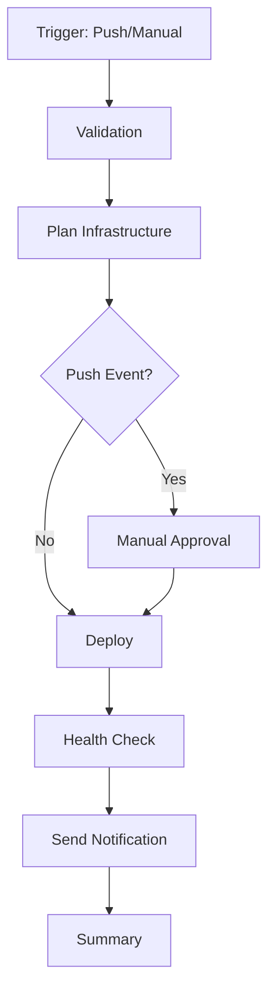

# Refactored GitHub Actions Workflows

## 📁 Structure

```
.github/
├── workflows/
│   ├── deploy-refactored.yml       # Main orchestrator (150 lines)
│   ├── _validation.yml             # Reusable validation (100 lines)
│   ├── _infrastructure.yml         # Reusable infra deployment (140 lines)
│   └── _health-check.yml           # Reusable health checks (130 lines)
└── actions/
    ├── setup-terraform/
    │   └── action.yml              # Terraform setup composite (25 lines)
    └── setup-ansible/
        └── action.yml              # Ansible setup composite (40 lines)
```

## ✨ Improvements

### Before
- **1082 lines** in single `deploy.yml`
- Hard to maintain and understand
- Lots of code duplication
- Difficult to reuse components

### After
- **601 lines** total across modular files
- **44% reduction** in code size
- Clear separation of concerns
- Reusable workflows and actions
- Easy to maintain and extend

## 🔄 Workflow Flow



## 📦 Components

### Main Workflow (`deploy-refactored.yml`)
- Orchestrates all jobs
- Handles approval gates
- Provides summary

### Reusable Workflows

#### `_validation.yml`
- Code quality checks
- Terraform validation
- Security scanning
- Can be called from other workflows

#### `_infrastructure.yml`
- Terraform plan/apply
- Ansible configuration
- Returns server IP as output
- Supports both plan and apply modes

#### `_health-check.yml`
- Post-deployment health checks
- DNS resolution verification
- HTTPS endpoint testing
- Email notification
- Creates GitHub step summary

### Composite Actions

#### `setup-terraform`
- Installs Terraform
- Configures credentials
- Runs terraform init
- Reusable across all Terraform jobs

#### `setup-ansible`
- Installs Ansible and Python
- Sets up SSH keys
- Creates dynamic inventory
- Reusable across all Ansible jobs

## 🚀 Usage

### Deploy (with approval)
```bash
git push origin main
```

### Deploy (manual, skip validation)
```yaml
# Via GitHub UI: Actions → Deploy Infrastructure
# Inputs:
# - action: apply
# - skip_validation: true
```

### Plan Only
```yaml
# Via GitHub UI: Actions → Deploy Infrastructure
# Inputs:
# - action: plan
```

## 🔧 Migration

### Option 1: Keep Both (Recommended for Testing)
1. Test `deploy-refactored.yml` first
2. Once verified, rename:
   ```bash
   mv .github/workflows/deploy.yml .github/workflows/deploy-old.yml.bak
   mv .github/workflows/deploy-refactored.yml .github/workflows/deploy.yml
   ```

### Option 2: Direct Replacement
```bash
# Backup old workflow
mv .github/workflows/deploy.yml .github/workflows/deploy-backup.yml

# Use new workflow
mv .github/workflows/deploy-refactored.yml .github/workflows/deploy.yml
```

## 🎯 Benefits

1. **Modularity** - Each workflow does one thing well
2. **Reusability** - Use workflows in other projects
3. **Maintainability** - Easier to find and fix issues
4. **Testability** - Test individual components
5. **Clarity** - Clear flow and dependencies
6. **DRY** - No code duplication

## 📚 GitHub Actions Features Used

- **Reusable Workflows** (`workflow_call`)
- **Composite Actions** (`uses: ./.github/actions/...`)
- **Workflow Outputs** (pass data between jobs)
- **Environment Protection** (approval gates)
- **Matrix Strategy** (parallel execution)
- **Conditional Execution** (`if:` conditions)

## 🔍 Debugging

### Check Individual Workflows
```bash
# Validate all workflows
for f in .github/workflows/*.yml; do
  python3 -c "import yaml; yaml.safe_load(open('$f'))"
done

# Check specific workflow
act -l -W .github/workflows/deploy-refactored.yml
```

### Local Testing with Act
```bash
# Install act
curl https://raw.githubusercontent.com/nektos/act/master/install.sh | sudo bash

# Test validation workflow
act workflow_call -W .github/workflows/_validation.yml

# Test full deployment (dry-run)
act push -W .github/workflows/deploy-refactored.yml --dry-run
```

## 📖 Additional Resources

- [Reusing Workflows](https://docs.github.com/en/actions/using-workflows/reusing-workflows)
- [Creating Composite Actions](https://docs.github.com/en/actions/creating-actions/creating-a-composite-action)
- [Workflow Syntax](https://docs.github.com/en/actions/using-workflows/workflow-syntax-for-github-actions)
